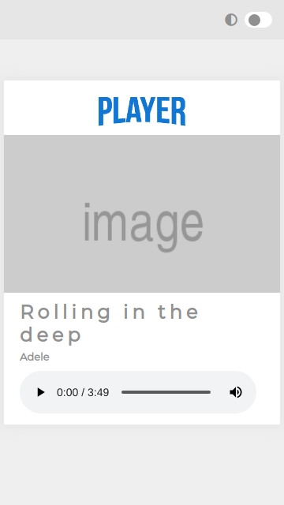

<p align="center">
  <a href="https://github.com/laisfrigerio/js-audio-player">
    
  </a>
</p>

# :copyright: Pl<|yer

An audio player made with pure javascript :blue_heart:

# :camera: Screenshots

<p align="center">
  <a href="https://github.com/laisfrigerio/js-audio-player">
    
  </a>
</p>

<p align="center">
  <a href="https://github.com/laisfrigerio/js-audio-player">
    
  </a>
</p>

## 🛠️ Stack

- HTML/PUG
- CSS/SASS
- Javascript
- Gulp (To compile sass/pug/js)
- Fontawesome icons
- Create logo [here](https://fontmeme.com/netflix-font/)

## Features

- :ballot_box_with_check: Setup project
- :black_square_button: Dark/Light Mode
- :black_square_button: Play a music
- :black_square_button: Pause a music
- :black_square_button: Play next music
- :black_square_button: Play previous music
- :black_square_button: Auto player musics
- :black_square_button: List tracks from an album
- :black_square_button: TDD

## Run

```
  npm install
  npm run dev:watch
```

## Generate Build

```
  npm run build
```

## :woman: Author

[@laisfrigerio](https://github.com/laisfrigerio/)

## 📄 License

This project is licensed under the MIT License - see the LICENSE.md file for details